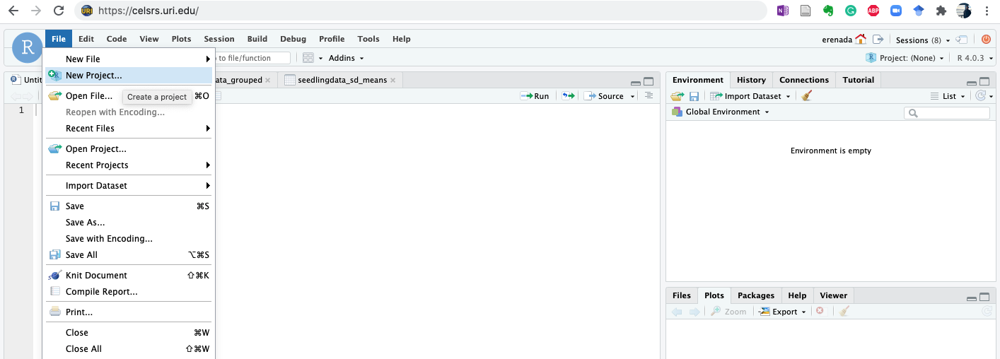
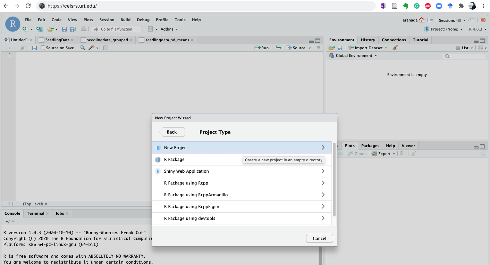
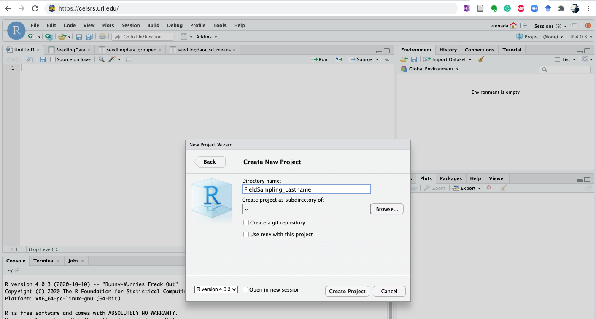
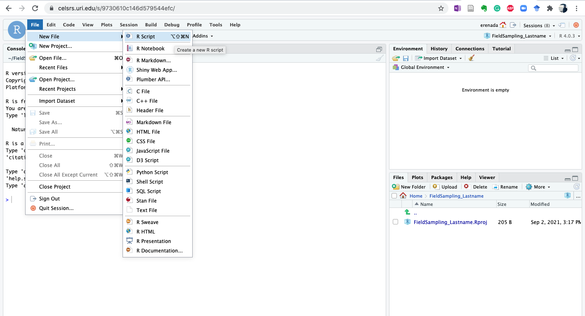
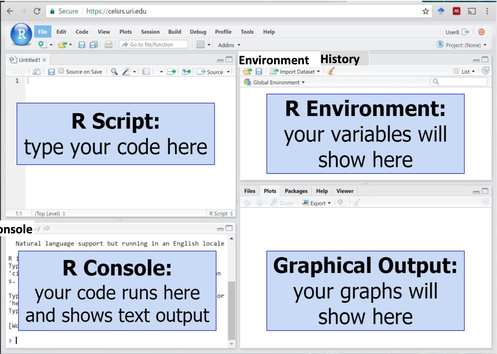
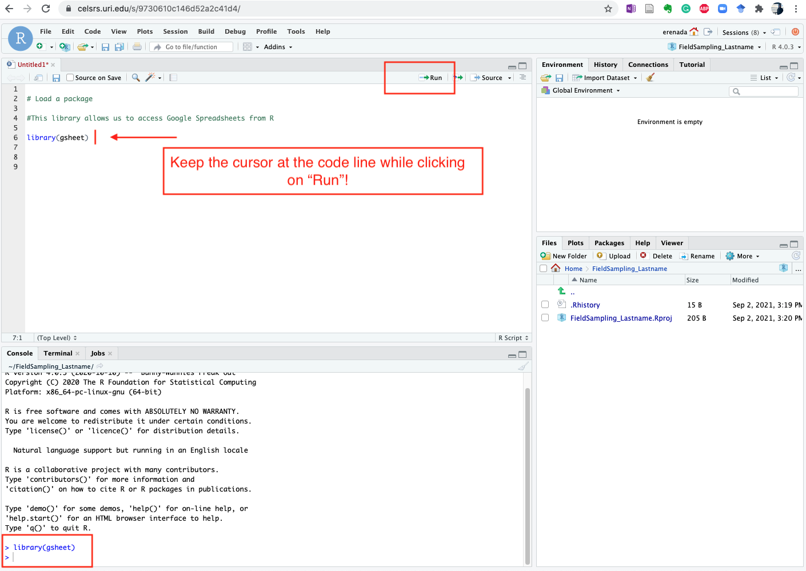
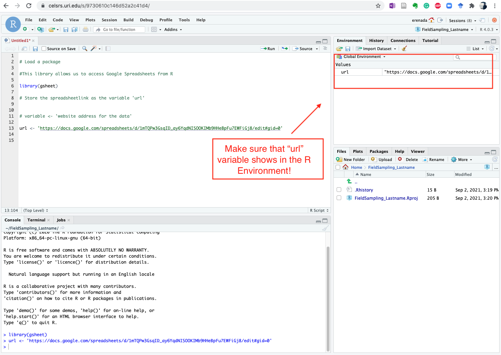
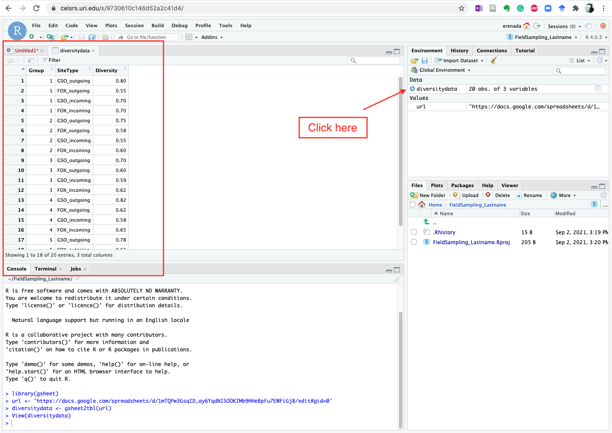

```{r setup, include=FALSE}
knitr::opts_chunk$set(echo = TRUE)
```


<div align="center">
### <span style="color: royalblue">**Field Sampling Data Analysis and Presentation using R Software**</span>
</div>


<div align="center">
#### <span style="color: royalblue">**BIO 104 Lab A1 Species Diversity Report**</span>
</div>


### <span style="color: royalblue">Goals for Lab 1:</span>

-  Import data into R
-  Save data in R as variables
-  Plot diversity data as a scatterplot and a box-plot
-  Plot certain parts of your data


#### <span style="color: royalblue">1. Getting Started</span>

You will be using R for data analysis this semester. R is a versatile, free data handling
software widely-used by scientists. R is great for organizing data, analyzing data, and
presenting data.

##### <span style="color: royalblue">Here is some basic vocabulary you will need when using R:</span>

- R script: the lines of code that you are writing (filename.R)

- R project: your R script, any variables you have created, and your current R
environment (filename.Rproj)

- Variable: a way to store your data for use in the R script. For example, if you type x=3
into R, then R now stores x (the variable) as the number 3.

- Package: a set of functions/codes that you can load into your script (examples -
gsheet, ggplot2)

- Function: an action or calculation that you perform on your variables (examples -
gsheet2tbl, subset, mean, library)

- Comment: does not run as code, starts with #. You use comments to keep track of
what your code is doing
More information on R is at http://www.datacarpentry.org/R-ecology-lesson/00-beforewe-start.html#why_learn_r


##### <span style="color: royalblue">Helpful Hints</span>

- Uppercase/lowercase matters!

- Spaces and empty lines do not matter in your code

- Do not use spaces in your variable names or file names (use _ or - or . )

- Links to GoogleSheets need to be in 'single quotes'

- #Comment your code so you know what's going on

- Store variables using "<-"

- Access the data points in a variable using variable [ ]


----
----


#### <span style="color: royalblue">TO START:</span>

 Log in to the R Studio server at [https://celsrs.uri.edu/](https://celsrs.uri.edu/)

**- Your username is your URI email address up to the @ sign**
 
**- Your password is your URI ID**

----
----


#### <span style="color: royalblue">Open RStudio and make a new project.</span>


**- File > New Project...**

**- New Directory and Empty Project**








**- Directory name: FieldSampling**
**- Leave the Subdirectory as the default: ~**


<br>

</br>


**Select from top left corner:**

**- File > New File > R Script **





Creating a new project and script will give you four windows in **R:**

- **R script:** where you type your comments and code, and save your work
- **R environment:** where all your variables show up and are organized
- **R console:** where the code runs and the text output shows. Errors show here too!
- **Graphical output:** where your graphs will show.


<br>

<br>


#### <span style="color: royalblue">2. How to get your data into R</span>

Last week you calculated the Simpson diversity index for the plankton samples at each of four site types (GSO outgoing, GSO incoming, FOX outgoing, and FOX incoming). A diversity index allows you to understand the variation in diversity among site types. The following lines of code will import your data (the class data about the diversity of each plot) directly into R from Google Sheets.


#### <span style="color: royalblue">2a. Load the packages you need</span>

The tools you need are found in "packages". Packages are like books from the library OR apps on your phone: packages are pre- written bundles of code that can perform the tasks we want. They contain functions and commands to perform analyses.

Here, we will load the gsheet package.

Type the code (from the grey boxes) into the SCRIPT window of RStudio (top left). With your cursor on the line of code, click Run (top right of the SCRIPT window in RStudio). The line of code will show up in the R console window once it is run (bottom left).


**Use the # symbol to add comments to your script as you enter the commands below.**

**FIRST line of your code should be:**


```{r first_lines}

# MyFullName, myTAname = learning how to make a boxplot in RStudio
# Always include hashtag comments!
# Start code by opening appropriate library packages
```


```{r package}
library(gsheet)
```


If the `gsheet` package is not installed, you can install by typing (without the "#" symbol):


```{r install_package}
#install.packages("gsheet")
```




<br>


#### <span style="color: royalblue">2b. Tell R where your data is</span>

Assign the link to your diversity data to the variable "url". You store a number or word or data to a variable using <- .

The variable name goes on the left of the arrow and the information goes on the right.

Use the link for your section. Find the UPDATED links on the homepage of the BIO104
Sakai site.

<br>

**EXAMPLE:**

<link here>

Section 21: https://drive.google.com/open?id=1a2gjbssmfXe9rA57gj8pftmQq_XjJh9pDhHebe_bTpI


Replace the link below with your url using following command. Use 'single quotes' !


```{r url}
url <- 'https://docs.google.com/spreadsheets/d/1mTQPw3GsqID_ay6YqdNISOOKIMb9HHeBpFu7EWFiGj8/edit#gid=0'
```


Always click Run with your cursor on the line of code. Once you have Run this command, make sure your new variable shows up in the R environment window (top right).


<br>



<br>
<br>


#### <span style="color: royalblue">2c. Load the data and store it as a variable</span>

Load the data from the spreadsheet (now stored as variable url). Use the function gsheet2tbl to get the data from the website for use in R. This function is from the gsheets package. Store the data as variable diversitydata.


```{r storedata}
diversitydata <- gsheet2tbl(url)
```


- The line was run correctly if you get the prompt (>) in the R console (bottom left)

- Make sure the diversitydata variable shows up in the R environment (top right)


<br>


#### <span style="color: royalblue">2d. Explore your data</span>

Click on the diversitydata variable in the R environment. The data stored in diversitydata will appear in the R script window (top left). It should look just like your spreadsheet data!


<br>



<br>


Click next to the > in the R console.

- Type ```diversitydata[1]``` into the R console and hit the Enter button on your keyboard. This is the first column of the data stored in ```diversitydata```.

- Type ```diversitydata[2]``` into the R console and hit the Enter button on your keyboard. This is the second column of the data stored in ```diversitydata```.

You may have noticed that R stored diversitydata as a table! Try accessing any datapoint in the table by typing:

- ```diversitydata[row, column]```

- For example: ```diversitydata[2,3]```

What happens if you try to access a column that isn't in the variable ```diversitydata```?

- For example: ```diversitydata[2,7]```


You get an error! Errors are fine - they tell when something is not right in your code. Read the error and then try to fix it. There are only 3 columns in diversitydata and your command tried to access column 7.

<br>

#### <span style="color: royalblue">3. Keep track of what your commands do == use #</span>

As you work, you are typing commands that you probably won't remember next week. Use the # symbol to explain your lines of code. Anything that you type after the # will not run in your code.


```{r comment1}
#load the package that allows us to access google sheets
library(gsheet)


#assign the website address for the data to a variable using an arrow <-
# "variable" <- 'website address for data'

url <-'https://docs.google.com/spreadsheets/d/1mTQPw3GsqID_ay6YqdNISOOKIMb9HHeBpFu7EWFiGj8/edit#gid=0'

##load the data from google sheets and store it as the variable diversitydata

# "variable" <- "command to work on"(data from last line)
diversitydata <- gsheet2tbl(url)
```


**Remember to use the # symbol to add comments to your script as you enter the commands below. As shown before, your FIRST line of your code should be:**

```{r firstline}

# MyFullName, myTAsName = learning how to make a boxplot in RStudio

```

**SAVE your work.** Save your code by clicking File > Save.


**Name your file: Lab1_YourName.R Remember to put ".R" at the end!**


Your work will save to the server that we are using for this lab.
You will be able to access your work on this server from other computers,
by using the web address ( https://celsrs.uri.edu/ ), your username and password.

<SSHere>

<br>

#### <span style="color: royalblue">4. Plot your data</span>

#### <span style="color: royalblue">4.a Load the plotting library</span>

```{r loadlibrary}
# Load the package that allows us to plot data

library(ggplot2)
```

Make sure you click Run after typing in each line of code.


#### <span style="color: royalblue">4b. Create the base layer of your plot</span>

Use the command ```ggplot```

- `diversitydata` is the name of the variable containing your data

- `aes` tells `ggplot` what the plot will look like ("aesthetics") including the x and y variables

- `SiteType` is the column name from the data table describing the site locations and is the column of data you want to plot on the x-axis.

- `Diversity` is the column name from the data table listing the Simpson Diversity index values and is the name of the column of data you want to plot on the y-axis.

Run this ggplot command.


The graph will show up in the Graphical Output window (bottom right).


```{r create plot}
# Create a plot

ggplot(diversitydata, aes(x=SiteType,y=Diversity))
```


<br>


#### <span style="color: royalblue">4c. Add data points to your plot</span>


Use the `geom_point()` command to add points to your plot.

- Put a + between the ggplot command and geom_point()


```{r addpoint}
# Add points to the plot using geom_point()

ggplot(diversitydata, aes(x=SiteType,y=Diversity)) + geom_point()

```


#### <span style="color: royalblue">4d. Add a boxplot on top of your plot</span>

- A boxplot summarizes your data by plotting:


  - the median (middle) value as a horizontal line
  – 50% of the data within the box
  - the remaining top and bottom 25% of the data as lines above and below the box. 
  - A boxplot based on the numbers 1, 2, 3, 4, 4 and 5 would have the middle line located at 3.5 (the median), the upper part of the box at 4 and the lower part of the box at 3.
  
- **The greater the range of the box plot, the greater the variation of your data!**

- Add a boxplot using the geom_boxplot() command

- Put a + between the geom_point() command and geom_boxplot()

- The + must come at the end of a line or the command will end and not plot the layer


```{r boxplots}
# Add boxplots to the plot using geom_boxplot()

ggplot(diversitydata, aes(x=SiteType,y=Diversity)) +
  geom_point() +
  geom_boxplot()
```

**Remember to add descriptive comments to your script!**

Note: the order of the plotting instructions tells R to make:

  1. The base plot
  2. The data points
  3. The boxplots on top of the data points
  


#### <span style="color: royalblue">5. Edit your boxplots</span>

#### <span style="color: royalblue">5.a Add axis labels to your plot</span>

The variable `Diversity` is an integer (a numerical value), which means it is on a continuous scale; thus, the functions to label your y axis is continuous `(scale_y_continuous)`.

Other examples of continuous variables are `time`, `weight`, or `date` since they are numerical integers. We use a discrete scale when plotting variables like Location or Tide or Color, where each variable is its own category `(scale_x_discrete)`.

<br>

  - Use `scale_x_discrete()` function and the `name = function` to label your x-axis "Conditions at site".

<br>

```{r xaxis}

# Plot just the boxplots and change the x-axis label

ggplot(diversitydata, aes(x=SiteType,y=Diversity))+
geom_boxplot()+
scale_x_discrete(name ="Conditions at site (MyName)")

```

<br>

  - Use `scale_y_continuous` to label your y-axis correctly. 

<br>

```{r yaxis}
# Plot just the boxplots and change the x-axis and y-axis labels

ggplot(diversitydata, aes(x=SiteType,y=Diversity))+
geom_boxplot()+
scale_x_discrete(name ="Conditions at site -MyName") +
scale_y_continuous(name="Simpson Diversity Index")

```


<br>


#### <span style="color: royalblue">5b. Save your boxplot as an image</span>

- Click on Plots > Export > Save as Image...

- Name your file (Lab1_Boxplot1) and click Save.

- To view your saved images, go to File > Open Files, then click on the image you want.

- Open the image to copy/paste it into your lab report (written in Word or GoogleDocs).


<br>


#### <span style="color: royalblue">5c. Look at a subset of data</span>

If you want to only show data from the two FOX Island sites, then make a new variable containing just these data by filtering your larger dataset.
First load the dplyr library, which contains a filtering function.

```{r subset, message=FALSE, warning=FALSE}

# Load the dplyr library
library(dplyr)

```


Then filter the data to include SiteTypes FOX_outgoing and FOX_incoming (the vertical bar means "and")


```{r subset2, message=FALSE, warning=FALSE}
# Create a new variable named FOXonly with just the FOX_incoming and FOX_outgoing data

FOXonly <- filter(diversitydata,SiteType=="FOX_incoming" | SiteType=="FOX_outgoing")
```

<br>

Now plot this new dataset using boxplots.

<br>

```{r plotsubset, message=FALSE, warning=FALSE}
ggplot(FOXonly, aes(x=SiteType, y=Diversity)) +
geom_boxplot()+
scale_x_discrete(name ="Tidal condition –MyName")+
scale_y_continuous(name="Simpson Diversity Index")
```


**Turn in this final boxplot of the data in your lab report. (Click in the Graphical Output pane:**

  **Plots > Export > Save as Image... > Name your file)** 


<br>


#### <span style="color: royalblue">6. Homework Assignment</span>

#### <span style="color: royalblue">Part 1. Graphing incoming vs. outgoing diversity at the GSO sites</span>

1. Subset your diversity data for just the GSO sites.

2. Make a boxplot like you did in Step5c. Hint: create a new variable named GSOonly

3. Turn in your boxplots from both sites.

4. Write a summary to compare the incoming and outgoing sites at both locations. Which has a higher diversity? Please explain why one tide may have a higher diversity index value than the other. (2-3 sentences)

5. Which has a greater amount of variation in the data? How can you tell?

6. Include your summary table of your data formatted according to the lecture and poster in the BIO 104 lab.


<br>


#### <span style="color: royalblue">Part 2. Graphing Long-Term Plankton Data</span>

The samples you worked with in class are part of one of the world's oldest datasets of regularly collected plankton samples. These samples have been collected weekly since 1957 at the Fox Island Station in Narragansett Bay, but only data from 1999 onward is available to the public. Find more information on this weekly plankton survey at https://web.uri.edu/plankton/data/.


In class, you calculated the diversity values of two samples from the Fox Island Station, and two samples collected from the GSO dock location. All groups in your lab counted and calculated the diversity values for these samples, allowing us to calculated diversity values for these two samples. To more thoroughly and accurately examine plankton diversity at the Fox Island station, you will analyze diversity data from this long-term dataset collected every week since 1999.

1. Make a boxplot comparing plankton diversity during incoming and outgoing tides at the Fox Island Site from all months in the long-term dataset, like you did in Step 4 (Hint: x=Tide).

2. Data are available at
https://docs.google.com/spreadsheets/d/1RdEzJqLi1vRcpR80nH__0n7nJJ8gPZxoxxuHQqvtbWs/edit#gid=0

3. Start with the commands:

```{r subsetexample, message=FALSE, warning=FALSE}
url2 <- 'https://docs.google.com/spreadsheets/d/1RdEzJqLi1vRcpR80nH__0n7nJJ8gPZxoxxuHQqvtbWs/edit#gid=0/'

FOXyearlydiversitydata <- gsheet2tbl(url2)
```

4. Select three months and make a diversity index boxplot comparing just those 3 months, like you did in Step 5c and Homework Part 1.


Hint: create a new variable named `threemonthsonly` and plot using `x=Month`.

5. Write a summary describing differences in diversity between tides and months at the Fox Island site (2-3 sentences). Discuss which of the months that you chose had the most variation (boxplot range) in diversity and highest median diversity value.


<br>


#### <span style="color: royalblue">Lab 1 Report Submission</span>

**Part 1. Done in Lab**

1. Individual Summary Table of your class’ data

2. Boxplot of FOX Island diversity data (created in Step 5c)

3. Boxplot of GSO diversity data (homework Part 1)

4. Summary of diversity differences (2-3 sentences)


**Part 2. Homework**

1. Boxplot of all FOX Islansd long-term diversity data by tide

2. Boxplot of FOX Island long-term diversity data for 3 months

3. Summary of diversity differences in the three months you selected (2-3 sentences)


**Examine the poster on the wall in class and the PowerPoint from today's lab to properly format your tables and graphs!**
